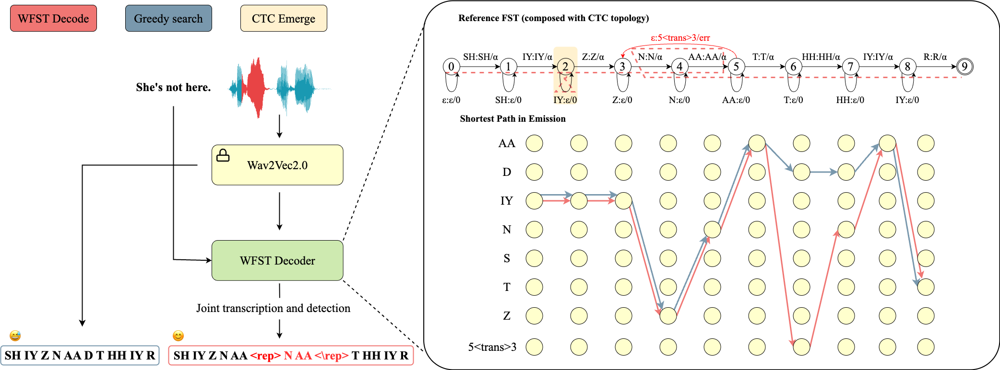

## Dysfluent WFST: A Framework for Zero-Shot Speech Dysfluency Transcription and Detection 👋

<!--
**DysfluentWFST/DysfluentWFST** is a ✨ _special_ ✨ repository because its `README.md` (this file) appears on your GitHub profile.

Here are some ideas to get you started:

- 🔭 I’m currently working on ...
- 🌱 I’m currently learning ...
- 👯 I’m looking to collaborate on ...
- 🤔 I’m looking for help with ...
- 💬 Ask me about ...
- 📫 How to reach me: ...
- 😄 Pronouns: ...
- ⚡ Fun fact: ...
-->

Accepted by [Interspeech 2025](https://www.interspeech2025.org/home). [Paper](https://arxiv.org/abs/2505.16351) available.

Basic workflow:

For inference, please check `main.ipynb` and `data` for example.

For the calculation of Weight PER, please check `./utils/wper.py`, you can get similarity matrix there as well.

## Set up the environment

1. Install pytorch (based on your cuda and python version)

2. Install k2 (based on your cuda and python version)

    Please follow the instruction [here](https://k2-fsa.github.io/k2/installation/index.html). 

3. Install other dependencies (very few, until you can run the main.ipynb)

4. Run the code.

## Use LCS-WFST

1. git clone https://github.com/Berkeley-Speech-Group/Neural-LCS.git

2. Follow the instruction in the repo to install the dependencies

3. run WFST_LCS.ipynb